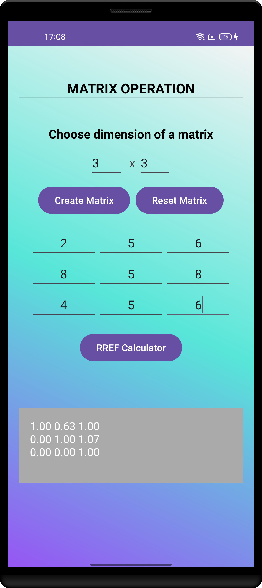
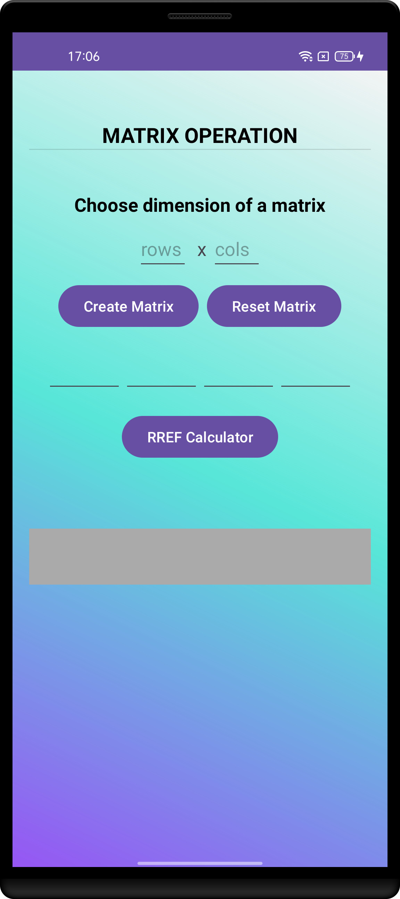

## Description
This is a simple Android application that can be used to find the RREF(Reduced Row Echelon form )
of a matrix.

## screenshot

## RREF(BACKGROUND)
The Reduced Row Echelon Form (RREF) of a matrix is a simplified version of the matrix where:

Leading 1s: Each row that has non-zero elements starts with a leading 1 (the first non-zero element in the row).
Leading 1 position: In each row, the leading 1 is to the right of the leading 1 in the row above.
Zero columns: The column containing a leading 1 has all other elements as 0.
Zero rows: Any rows consisting entirely of zeros are at the bottom of the matrix.

## Tech stack

-[Kotlin](https://kotlinlang.org/):a cross-platform ,statically typed, general-purpose programming language with type interface.
-**viewModel**
-**LiveData**-{To be fully implemented soon}
